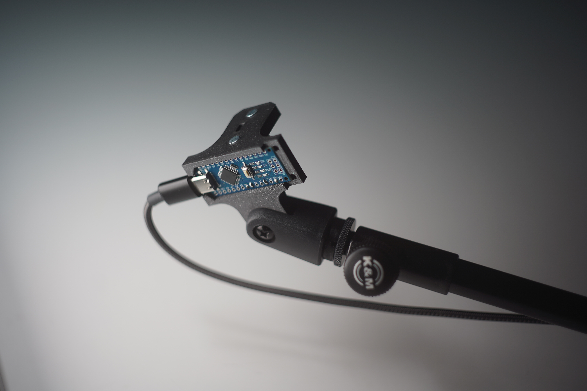

# distance-midi-controller
**A high-precision, low-latency MIDI controller that turns hand and body gestures into expressive musical control, using a VL53L0X ToF distance sensor in a 3D-printed case mountable on any microphone stand: open-source and ready to be modified and hacked.**

## Features
- **Hands-Free Control:** Modulate MIDI parameters gesturally
- **High Precision & Low Latency:** Utilizes the VL53L0X Time of Flight (ToF) sensor with optimised readout for gestural control and fine-tuned balance between latency and acuracy.
- **Microphone Stand Mountable:** The 3D printed case is designed to be mounted on any standard microphone stand for easy and flexible placement of the controller
- **Low Cost & Easy to Build & Modify:** Houses a standard off-the-shelf VL53L0X sensor bord and any microcontroller with 43x17mm footprint

## Required Materials
- 1 Arduino Nano or compatible microcontroller
- 1 VL53L0X dev board. We've been using [this one](https://www.az-delivery.de/en/products/vl53l0x-time-of-flight-tof-laser-abstandssensor?srsltid=AfmBOor0_s5rByMJTX5xQ86db2U276sb2SCJpDImnMb2X7a74YgMQruc)
- [K&M 85055 microphone clamp](https://www.k-m.de/en/products/microphone-stands/accessories/microphone-clips/85055-microphone-clip-black-3-8-and-5-8) The lower section of this is used to hold the 3D printed housing and provides a thread for mic stands. Just unscrew the 'clamp' part and keep the threaded bottom part.
- 4 x 3cm of thin gague wire to connect the ToF sensor to the microcontroller. 2mm diameter including the insulation fits fine.
- 2 M3*10mm countersunk screws & 2 x M3 nuts. These are used to mount the sensor to the housing.

## Software & Setup
1. **Install Arduino IDE:** If you don't already have it, download and install the [Arduino IDE](https://www.arduino.cc/en/software/?_gl=1*4je9gw*_up*MQ..*_ga*MTk5MjkyNzY2My4xNzU3NDM2MDk1*_ga_NEXN8H46L5*czE3NTc0MzYwOTUkbzEkZzAkdDE3NTc0MzYwOTUkajYwJGwwJGgxODE3MzkxMjg3).
2. **Install Libraries:**
  - Open the Arduino IDE and go to Sketch > Include Library > Manage Libraries....
  - Search for and install the VL53L0X library by Pololu (this allows for a few more options to fine-tune the sensor readout)
  - Search for and install the MIDIUSB library by Gary Grewal (for future iterations of the controller)
3. **Upload the Code:**
  - Clone or download this repository.
  - Open the tof_controller.ino file in the Arduino IDE.
  - Select your board and port from the Tools menu.
  - Modify CCNUMBER and CCCHANEL at the top of the sketch to fit your needs.
  - Click the "Upload" button.

## 3D Printed Enclosure
The STL file for the enclosure is included in this repo.
- **Recommended Material:** PETG or PLA
- **Infill:** 50% or more. The rounded part of the print is going to be clamped into the mic-holder and has to withstand a bit of pressure.
- **Layerheight:** 0.12mm for a precise cutout of the microcrontroller-slot. The Arduino is pressed in and held in place by friction here.
- **Enable Supports** for the overhang in the microcrontroller-slot, the pin-cutout and screwholes.

## Assembly
1. **Prepare VL53L0X board:** Solder 4 short wires onto pins VCC, GND, SCL & SDA
2. **Mount VL53L0X board onto enclosure** using the M3 screws and nuts
3. **Press Arduino into enclosure.** The tolerances in the print should hold it in place but you might need to experiment with layerheights if it doesn't fit.
4. **Solder VL53L0X to Arduino:** Connect the wires you previously soldered to the sensor board to the Arduino:
  - 5V -> VCC
  - GND -> GND
  - A5 -> SCL
  - A4 -> SDA
5. **Mount Enclosure on Microphone Holder.** The printed enclosure fits the [K&M 85055 microphone clamp](https://www.k-m.de/en/products/microphone-stands/accessories/microphone-clips/85055-microphone-clip-black-3-8-and-5-8) perfectly, but should be easy enough to adjust to different holders.

## Roadmap
- Replace Arduino Nano with Arduino Pro Micro so the board can act directly as a class-compliant MIDI device
- Redesign 3D printed housing to a cylindrical design
   - protect Arduino inside an enclosure
   - place USB-C port on the bottom for better cable-routing
- Configurable MIDI mapping via serial or web UI
- Extend and test distance range to allow for wider range of movement
